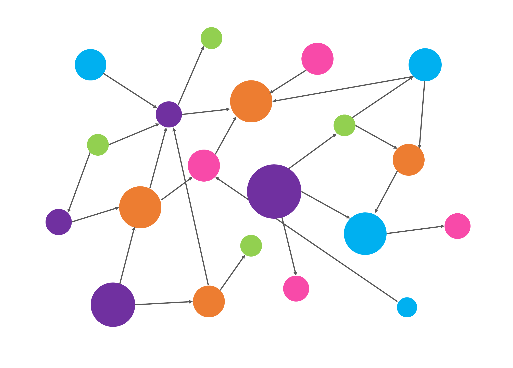
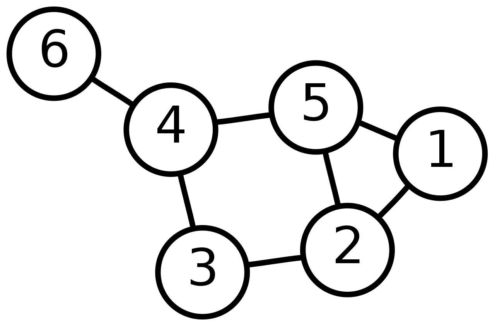
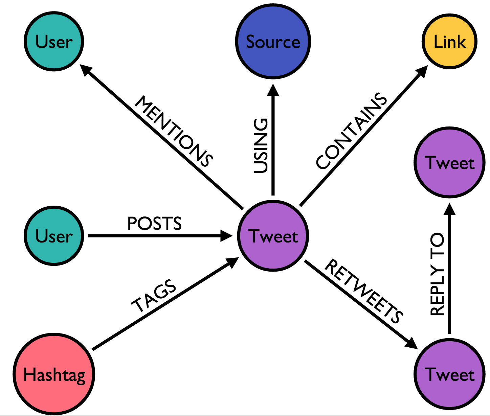

### Graph databases

In a graph data base, the information is stored just like you might sketch ideas on a white-board. The data points are stored and displayed trough nodes and relationships instead of tables, or documents. This data structures is advantageous to find and visualize connections on the data and provides some computational advantanges beause it could facilitate the queries.

## What is a graph ?

***"In mathematics, and more specifically in graph theory, a graph is a structure amounting to a set of objects in which some pairs of the objects are in some sense "related". The objects correspond to mathematical abstractions called vertices (also called nodes or points) and each of the related pairs of vertices is called an edge (also called link or line)."***

In a graph we can find two main elements: 

- Node (Vertex): Representing an object in a graph. For database purposes, the nodes normally represent, information of a unique object.

- Relationships (Edges): Are the connections between two nodes. For data application, the edges will imply relationships or characteristics common to the connected nodes.

For example, the following graph contains six nodes and seven edges:

For the purpose of this course, we will focus on the application of graph theory into the construction of databases. Our goal is to provide you an extra tool to improve your data skills.

Observe the following image:

**Nodes:**

- The nodes are tagged with labels representing key attributes to describe the information. In this case, Tweet, User, Hashtag. These labels could also include properties like associated meta-data on a tweet.

- The nodes represent objects or entities
- Can be labeled
- May have properties

**Relationships:**

- The relationships (Edges) contain the information to indicate the link between nodes and an specific direction. For example:
An `User` ---`POSTS`--> a `Tweet` but a `Tweet` --`MENTIONS`--> an `User`. 

- In general, the relationships must have a type and a direction. The type indicates how the relationship relates two nodes and the direction the way they interact.

- Depending of the relationship the direction can be unidirectional (as seem on the example) or bidirectional.

### The relevance of Graph databases

Any Data-related professional is looking to understand the hidden or non obvious connections behind the data. For projects where the information represents a variety of relationships, the use of graph databases could facilitate your work, data exploration and visualization. After all, the objective is to reveal insights that can be valuable for stakeholders and any tool that can facilitate this process should be welcome on your data-professional toolbox.

### Resources

- [Wikipedia](https://en.wikipedia.org/wiki/Graph_(discrete_mathematics))

Resources to get hands using industrial tools:

- [Neo4j Graph Academy](https://neo4j.com/graphacademy/)
